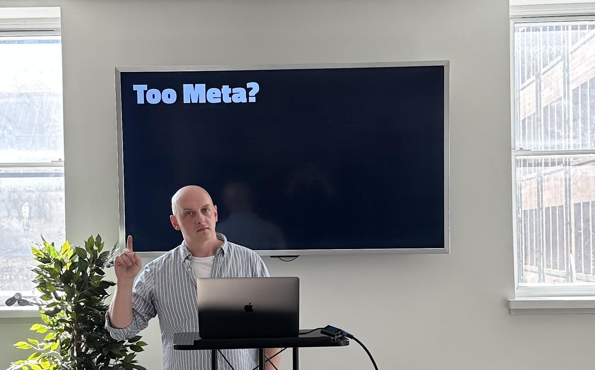

theme: Titillium, 1


Prework:

* pack a stopwatch. Use iphone if you forget.
* Turn up to the stage ahead of time. Take a picture of yourself with the "Too meta?" slide. Put it into this run of the slide deck.
* Capture the stopwatch time. Add to the data table.

---

^ TODO nothing yet about WHY we estimate (and why most of it is pointless). What estimates are for,

---

---

# Estimates And Complexity
## A Tale In Forty Two And A Half Minutes

@garyfleming

^ This talk is called Estimates... [start stopwatch visibly]
^ My name is Gary, I am a ..., been doing agile stuff for many years.
^ WIP TALK! What I want...
^ My first question to you is: do you think that this talk will take 42.5 minutes? You'll have a few minutes to think about it.

---

# Disclaimer

Opinions expressed in this talk are my own, and not representative of my employer's views.

^ While you ponder that here's the a small disclaimer. Much of the experience this talk is based on happened before I started with my current employer.

---

# Why Do We Estimate?

* How long will something take?
* When will we finish some work?
* How much work can we bring in to a sprint?
* Given two pieces of work, which should we do first?
* Build understanding
* Build predictability

^ Lots of reasons. There are a huge number of valid reasons to estimate. 

---

# We Estimate For Predictability

^ Last one is hugely important. We're mostly looking for some kind of predictability. Whether it's knowing when something will be available, when we'll get value, what we should do first, ultimately these questions are about predictability. People mostly estimate for some kind of predictability

---

# What do we estimate?

* Effort
* Elapsed time
* Cost
* Value
* Complexity
* Understanding

^ Likewise, we can estimate a lot of different things.
^ I'd also argue that the things nearer the bottom are more interesting and useful than the things at the top...

---

## Why do we really estimate?
## What do we really estimate?
## What do we really do with our estimates?

^ But what do we actually do? Most of the time the estimates I've seen teams create are not useful because they're not estimating for themselves. They're estimating to keep someone/thing else happy: a process, a JIRA scorecard, a project manager or other leader. External factors drive the estimates, not the team themselves.
^ They estimate almost purely in terms of effort/time. It's *rare* to see teams talking about complexity. Or value. Or cost. They're playing at estimation, rather than valuing it.

---

## Why do we really estimate?
## What do we really estimate?
## What do we really do with our estimates?

^ Consequently what they do with the estimates is.. record it. They don't particularly reflect on it or use it to make new decisions. They don't drive direction. Those why we estimate questions are a setup for "Okay and now what should we do?" They're not an answer in and of themselves. 

---

# Upfront Anti-patterns

* Scope roughly settled upfront
* Estimated in real units of time
* Estimate given when we have least knowledge
* Scope/estimate recorded upfront

^ If we settle the scope upfront, and give estimates in real units of time (or a near proxy), we're doing so when we have least knowledge of what we're going to achieve. That is, we haven't learned much yet fo inform us, and gain **experience*. So recording that upfront is just waste.

--- 

# Just Don't

^ If this is your approach to estimation, I've got great news: you'll probably be just as well off just not doing it. If your estimates don't feed back into a meaningful decision making process, if you don't look at the gamut of things you can estimate, you can probably just skip it.
^ Even if you do engage a little more, I'm going to argue that just focussing on time isn't as useful as other techniques.

---

# Forty Two And A Half Minutes.

^ Back to the question: who thinks this talk will be done 42.5 minutes after I started? i.e. who thinks it'll take that amount of time or less?
^ I mean, I could stop the talk right now and fulfill that criteria, but I probably wouldn't have done the job of delivering the talk.
^ Let's imagine I do a reasonable conference talk in terms of content and takeaways: do you think I'll finish within a few minutes of the title's implicit **deadline**?

---

# Deadlines

^ I used the word deadline there. I'm sure most of you are familiar with deadlines: A date is given by when something absolutely positively must be complete or there will be GRAVE CONSEQUENCES.
^ I think the problem with deadlines is that they're largely self-imposed and... nothing really happens when they go whizzing by.

---

# Deadlines

Often come from:

* HIPPO
* Wild guesses
* Psuedo-estimation process derived from story pointing.

^ Many deadlines come out off...
^ Last one is especially pernicious, because we've got a tendency to turn a questionable estimation process into questionable dates in a questionable way. We'll come back to story points.

---

# Real Deadlines

Examples:
* Building an app for a sporting event,
* Regulatory requirements kicking in,
* Physical manufacturing (or other lead times you don't control).

^ The only real deadlines I've seen are where they're tied to external events that we can't control or where there is a dependency on something else with a long lead time we can't control
^ They're not going to delay Wimbledon for your app.
^ HMRC aren't gonna move the end of the tax year for you.
^ Making iPhones takes time; pretty hard to control for that.

---

# Fakelines

^ Most deadlines aren't real. There are few meaningful product consequences. Doesn't mean we can entirely ignore them, however. There can be very real social consequences, fair or unfair.


---

# Example: Does this talk have a deadline to finish?

^ Given the length of my slot, I *can* go a few minutes over my imposed deadline. 45 minute slot, gives me 2 and a half minutes of slack. I *might* be able to go on a few minutes into the lunch break/next slot too.
^ But eventually that has social consequences: you want lunch so you'll likely leave, The next session starts at some point so someone would come and get me off stage. And I'd probably not be invited back again. Rambling on doesn't help anyone.
^ i.e. there are social consequences

---

# Example: Do you have a deadline?

^ IRL Maybe a manager gets annoyed that their self-imposed deadline they reported didn't get met. It doesn't matter that it was realistic or not, that it was artificial or not; there's a loss of trust and social capital. Teams who fail to deliver to deadlines consistently will lose trust.
^ Conversely, teams who are frequently held to unrealistic and arbitrary deadlines will lose trust in their management and leadership - Why should they be treated poorly for bad deadlines? Particularly those in which they didn't participate.

---

## _When a software delivery group is forced to estimate tasks, this tends to trap them in an environment of obligation without responsibility. And often the person demanding these estimates finds themself in the very same trap._
## -- JB Rainsberger

^ To summarise: there are often consequences for deadlines, real or imagined, being missed; for both those held to the deadline and those who set it.

---

# 42.5

^ Anyway, back to 42.5 minutes.
We've established some external constraints (someone will kick me off stage eventually), but why do you think I'll finish on time? What information is that based on? Is it just that I put it in the title? Let me drip feed you a few things

---

# 42.5

* I claim I've never gone over a talk time in the past. Not even by a few seconds.
* You've seen me talk before and the last claim is true in your experience.
* You've been to this event before and people generally finish on time.

^ Experience. Experience matters. If we've got relevant experience in doing something, we're better able to predict whether we can do something similar... assuming it's the kind of thing that is repeatable, where we have experience. Repeatable knowledge is the most estimable knowledge.


---

# A Kind of Complexity From Experience


^ Liz Keogh has, in the past, talked about kinds of experience and what they mean in terms of how we act (building on Cynefin). You can think of these as broad categories on a spectrum.

---

# A Kind of Complexity From Experience

* **You've done it before**
* **Someone in the team has done it before**

^ First two are pretty straight forward. If you've got quick access to experience, you can probably break it down and estimate accurately.

---

# A Kind of Complexity From Experience

* You've done it before
* Someone in the team has done it before
* **Someone in the company has done it before**

^ Third one: need knowledge acquisition, cross-training, cross-applicability to your system. You probably can't estimate directly. Broad timelines based on nearby experience

---

# A Kind of Complexity From Experience

* You've done it before
* Someone in the team has done it before
* Someone in the company has done it before
* **Someone in the world has done it before**
* **No-one has done it before**

^ Fourth and fifth mean you've got very little chance of estimating accurately. You don't have any knowledge of how to do them. You know they might be doable, or they might not. Instead, all you can do is break down the goal into a series of experiments to learn what you don't know. Rather than estimate the effort in a task, you timebox how long you'll spend learning a thing. At the end of the timebox, you check whether you've learned enough and, from a position of slightly more knowledge, you estimate how much longer you need to learn.


---

# 42.5

* I've done this talk one time(s) before.

| Place | Date | Slot time | Run time |
| --- | --- | --- | --- |
| Lean Agile Glasgow | 14th June 2023 | 45m approx. | ? | 
| Agile in the city Bristol | 28th June 2023 | 45m approx. | ? |

^ I've barely said these words before. I did a single warmup, and have revised the deck. I ran it intentionally short to give time to incorporate feedback. *I* am lacking experience. How does that make you feel about the 42.5?

---

# 42.5

^ There's clearly a structure I'm following and a plan I have in mind, but I don't know if that's sound knowledge based on my understanding of this subject and the constraints we have today. I mean, the fact I have slides is a pretty obvious indicator that it's not all just off the cuff thinking. I had to write the slides. It took many hours. Including writing and planning to say this part here about how I haven't practiced, but do have a structure.


---

# Too Meta?

^ Some of you are probably getting a little bit uncomfortable about the metaness of the talk. Like the talk is a little bit too much about the talk.

---




^ But think about this, a talk is a deliverable, with a fairly real deadline, based on some knowledge and some unknowns, that we have to make decisions on upfront. I had to submit a title and and abstract and learning outcomes about this talk before I had written it. I had to decide the product months in advance, rather than feel my way along.
If that's not a microcosm for a lot of software development, I don't know what is.

---


* Scope roughly settled upfront
* Estimated in real units of time
* Estimate given when we have least knowledge
* Scope/estimate recorded upfront

^ Sound like a familiar upfront anti-pattern?
^ We'll talk a bit soon about how I avoided much of this in practice.

---

# 42.5

* I wrote the talk title 5 months before I wrote the talk (because I thought this stopwatch idea was a good hook).

^ Let's focus on just the title for a minute. The title isn't based on knowledge of the talk itself. I had to submit the talk title, description, and learning outcomes last year. November/December. I know the subject, but I didn't know the final length. I didn't know everything that would make the cut.
^ So how did I Pick it?

---

# 45 minutes

* Too round
* Too vague

^ I've done this before; I know I can generally fill 45 minutes of airtime with reasonable material on most subjects I care about, and Ive been doing workshops on estimation recently. But 45 minutes sounds too round. Sounds like 45ish. Sounds like "I'll fill the slot, maybe"

---

# 42 Minutes, Thirty Three Seconds

* Too precise

^ I could've called the talk "42 minutes, and thirty three seconds" and you'd have believed me less. It feels a little more contrived. No-one thinks it'll be finished at exactly that point, but the extra precision makes it feel like it should be. Let me illustrate that.

---

# 42 Minutes, Thirty Three Seconds, 481 Milliseconds

* Far too precise

^ Add in milliseconds and it gets weird. No-one would (or should) believe that the talk will take that long. It's overly precise for the context. There are too many things that can vary. To be anywhere that precise.

---

# 42 and a half minutes

* Believablely precise
* Not too vague, not too precise
* The sense of the shape, but a little blurry.

^ So I changed it to 42.5. I know that 42.5 is a more interesting title because of its increase in precision. 42.5 sounds like I'm being pretty precise without being silly. It's the Goldilocks of this context.


---

# Increasing precision of estimates can have negative effects

^ Good estimates aren't about precision. They're not. Broad estimates that have implicit error bounds and uncertainty help establish trust. They show, to some extent, that you know that you don't know.

^ Overly precise estimates in this context decrease trust. They decrease. Using flat numerical systems with no error bounds leads to all sorts of weird behaviour and misunderstanding.

---

# Story Points

^ .. Which inevitably brings us to story points.
^ Let me start by saying I don't like story points. They can be a useful tool when used appropriately, but rarely are. They're like a hammer that mostly gets used as a saw; but with people just accepting that this is what you do in Agile. You'll note that there is no team-level agile methodology that promotes story points.


--- 

## _Scrum is founded on empiricism and lean thinking. Empiricism asserts that knowledge comes from **experience** and making decisions based on what is observed. Lean thinking reduces waste and focuses on the essentials._
## Scrum Guide

^ You might think that Scrum does, but there isn't any mention of them in scrum guide. It simply promotes empiricism. By empiricism, it very clearly means experience. Having people who know what to do, observing what happens each iteration, and then using that to inform what happens next.
^ Sounds a lot like Experience-based complexity, right?
^ To be clear, I'm not a massive scrum fan. Even ardent scrum teams should visualise, inspect, and adapt their way to something better.
^ SAFe does. Not team level. Leave to audience to decide if agile.

---
# Story point problems

^ They fall into a part of the precision spectrum that is... difficult. They look like they could be either quite precise or quite vague. They don't really inform. 
^ Have you seen a story point? They look like numbers but they're intended to be relative i.e. "this one is bigger than that one" , but not by how much. People often treat them as time. People think you can do maths with them.

---

# 2 + 2 + 2 + 2 != 8

^ In most uses of story points, a 2 would be something quite small, quite well understand, and quite achieveable. An 8 should be something that's large, more complex, more unknowns, less experience in the team.
^ a bunch of known things aren't the same as *any* number of unknown things.

---

# 2 + 2 + 2 + 2 != 8
## Different Experiences!
## Different Predictability!

^ Fundamentally, these aren't different sizes: They're different **experiences** and have to be treated as such. An 8 is less **predictable** than a 2.

---

# Velocity

^ Velocity is this lack of coherent experience taken to an extreme. The fact people believe we can add a bunch of different story points together and gain predictability is silly. The only way you can reasonably do that is if they're all the same experience, they share the same level of complexity.
^ How do we do that?

---

# A Better Approach To Estimates

^ As I said earlier, just don't... until you have to. Most estimates are waste and you don't need to do them. 
^ More importantly understand the question you want to answer. Assume for a while it's not about time, but instead is about something more important like value or complexity. Only after that consider using techniques for estimating against time.


---

# Predictability: Slicing

## The art of making 8s into 2s

^ One such better approach is slicing. Slicing is the art of taking big things, like our 8, and turning them into smaller valuable things that we understand. It's making 8's into 2s.

--- 

# Predictability: Slicing

## The art of making 8s into 2s

* Value
* Prioritise
* Flow

^ First we take our big chunks of work, "features", "epics", and break them down into smaller pieces of value. An epic about session management becomes features on logging in, logging out, password resets, 2FA. Those features get broken down into smaller useful parts.
Password reset becomes ...? ^ TODO this might be a bad example.

^ TODO this is screaming out for a visualisation

---

# Slicing

* Value
* Prioritise
* Flow

^ These can then be prioritised to get a walking skeleton. What's the minimum number of stories you can do to get end to end value?
^ Then Flow is a natural outcome. Lots of small, predictable parts ordered for value. As a bonus, this helps you deliver frequently and find out whether your assumptions about value (which were estimates) are true.
    - Pretty much *always* deliver value to users way before "deadline"
    - Can then prioritise with more information.
  

---

# Slicing and Unknowns

^ What about the things we lack experience in? You break those up in the same way. You find a small experiment that you timebox in the same way as before and flow it through your system. The outcome might be lots of other small parts

---

# Slicing: Writing This Talk

* How Estimates Are Used
* Deadlines
* Complexity
* Precision
* Problems With Sizing
* Slicing (**which is this bit**)
* Probabilistic Forecasting 


^ I wrote down all the ideas I wanted in the talk, some were specific ideas and slides, some were just big themes. Just brain dumped them all. Grouped them together into themed sections. Kind of like our 8s.

---

# Slicing: Writing This Talk

* How Estimates Are Used
  * Dysfunctions
* Deadlines
  * Fakelines
* Complexity
  * Experience
* Precision
...

^ For each one, I tried to find a small idea within them that would serve as just enough to cover the topic. I then wrote that part. By doing this I had an MVP; end-to-end. I knew that, even if I ran short, I'd turn up and say something valuable. Also much easier to add to this skeleton


---

# Slicing: Writing This Talk

* How Estimates Are Used
  * How They Should be used
  * How They Are Used
  * Misunderstandings
  * Dysfunction

^ For each of the sections, I wrote down a bunch of small items that would explain the big idea. Any time one of those felt like it would be too big, I sliced it down again: what small ideas would explain the big one while giving value? If there was something I didn't know, what small bit of research/experimentation could I try?


---

# Slicing: Writing This Talk

* How Estimates Are Used
  * ✅ How They Should be used
  * ✅ How They Are Used
  * ❌ Misunderstandings
  * ✅ Dysfunction

^ I could then also look at value. Which of these are essential? Which are less useful? Remember the bit at the start about misunderstandings? No, because I cut it out. I knew there was other material here that mattered more.

---

^ I can slice when I present too. I'm not an actor on stage, reading lines in the same way, over and over. If I'm running long, I can cut bits out as I go.

---

## _I can slice when I present too. I'm not an actor on stage, reading lines in the same way, over and over. If I'm running long, I can cut bits out as I go._
## Me, just now

^ I can also choose whimsy.

---

# Slicing is better than time-based estimation

^ Slicing is a better than time-based estimation more often than not. It helps you always be ready to go, get to a workable state quickly, and build predictability.
If you want to know how much more you've got to do, then it's not that hard to figure out. You've got a bunch of evenly sliced small parts that are predictable?  So you take the time it's taken to do one of these and multiply by the number you have. Simple. It's still gonna be rough, because perfect slicing is hard and you're not perfect, but it's better than adding up 2, 8, and 13 and hoping that these very different things cohere.

---

# Really Need Dates?
## Probabilistic Forecasting

|  Size | Count | Span |
| --- | --- | --- |
| S |   |   |
| M |   |   |
| L |   |   |

^ So you really, really need dates. Because you actually have a deadline. Don't worry, everything we've talked about already still works. Slicing, experience etc
^ First, slice your work up into things that are the same size. If you can't do that, get them to a handful of buckets where everything  in that bucket are roughly similar in size and experience. Let's say S/M/L. To be clear you still want mostly small.


---

# Probabilistic Forecasting

|  Size | Count | Span |
| --- | --- | --- |
| S |  5 |   |
| M |  2 |   |
| L |  1 |   |

^ How many of each you have. Still want mostly small. You'll see why soon

---

# Probabilistic Forecasting

|  Size | Count | Span (days) |
| --- | --- | --- |
| S |  5 |  1 - 2 |
| M |  2 |  2 - 5 |
| L |  1 |  4 - 8 |

^ Next the fun part. You go figure out how long these have taken in the past. Stuff you've previously thought was a small? How long did it actually take? Not an estimate: the actuals. That should produce a range. The smaller the item, the smaller the range. That's the unknown/experience effect coming in. Don't have data? You probably can't reliably predict anything then.
^ TODO add bit on maths on ranges? Min/Max?
^ TODO min = 5 + 4 + 4 = 13
^ TODO MAX = 10 + 10 + 8 = 28

---

# Probabilistic Forecasting

|  Size | Count | Span (days) | Iter 1 |
| --- | --- | --- | --- |
| S |  5 |  1 - 2 | 1 1 2 1 2 |
| M |  2 |  2 - 5 | 5  2 |
| L |  1 |  4 - 8 |  6  |


SUM => 20

^ Then the fun part. You start running a monte carlo simulation.
For each small, you get a computer to pick a random number from your range i.e. 1 -2 5 times. Then for M. Then L. We call this an iteration. You sum up the numbers
Simplifying: Ignoring outliers (the time a small was 10), and distributions.

---

# Probabilistic Forecasting

|  Size | Count | Span (days) | Iter 2 |
| --- | --- | --- | --- |
| S |  5 |  1 - 2 | 2 2 1 1 2 |
| M |  2 |  2 - 5 | 4 4 |
| L |  1 |  4 - 8 |  7  |

SUM => 23

^ Then do it again.

---

## SUM => 23, 20, 19, 21, 20 ...

^ In fact, keep doing it. Do it a thousand times. Or get a computer to do it. These are all little attempts to simulate the future using real data from the past.

---

```
        x
        x   x
        x   x
        x   x   x
 x      x   x   x   x
 x   x  x   x   x   x       x
18  19  20  21  22  23  24  25
```

^ TODO congrats you now have data. You can use this to. (20 samples shown)
On average, you finish on day 21. Maybe 50% isn't good enough. 100% chance on day 25. etc
Confidence intervals.

---

# Lot of work?

^ Yes, I know, I keep saying you probably shouldn't do this unless you really need it. But don't worry, there are lots of tools that do this for you. Many even tie-in to your tracking systems to pull your actual data too. But avoid this unless you really need an estimate


---

# Summary

- Most estimates are waste. Just don't.
- Deadlines should be inspected
- Focus on Experience
- Slice! Value first, and time next.
- Dates? Forecast, don't estimate.


---

# Thank You

@garyfleming

^ Thanks! !visibly stop  stopwatch and wait!
^ I do have time for questions, but let me pre-empt the first one: what time does the stopwatch say? To which, I'll answer: It doesn't matter. The estimate, like most estimates, never mattered. I've not broken my social contract deadline, I've delivered the value I hoped to deliver (info about the estimation), I did it by breaking the talk down, focussing on the outcomes I wanted, and then slicing until we got here. It doesn't matter whether or not we took 42.5 minute.
^ Happy to take questions on anything, apart from story points. For some reason people get weird about them. If you're stuck on the story point material, just go on with your day. Sorry for wasting the last <stopwatch time> of your life. Ah, dang!

---

---

# What time is on the stopwatch?

^ People are predictable. But it doesn't matter what time the talk actually took. It matters that we finished broadly at the right time, having hopefully delivered value every few minutes, and with a better understanding of the issues around estimation.

---

# How do I convince my stakeholders?


^ It's about trust. Dates by themselves won't build trust. Delivery on time builds trust. Even better, delivering value consistently and quickly way before a date will build trust. Then just stop giving the dates. They won't notice if you're delivering.


---