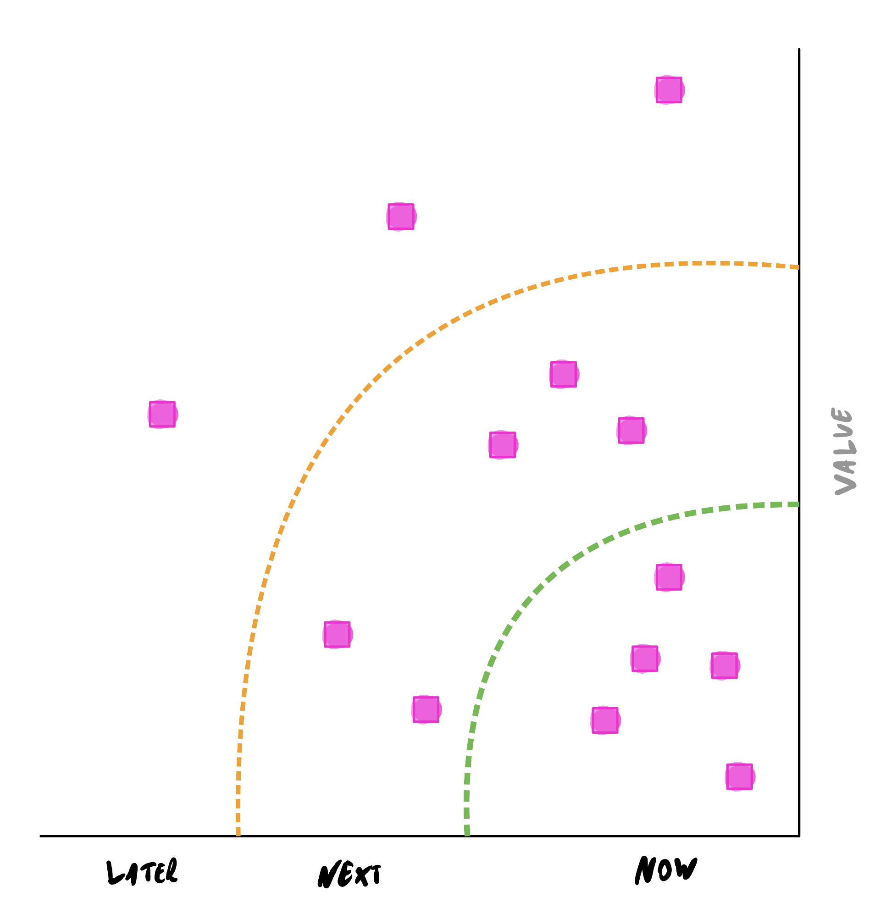

theme: Space, 3

# Perfect Patterns For Product Partnerships And Engineering Excellence

@garyfleming[**@mastodon.social**]

^   * Jump to the end - before I explain what the talk is about, I'm going to start, unusually, with the summary

---

# Summary

* Align on key decision tools
* Share Power and Decisions Where You Can
* Have More Real **Conversations**

^    * Talk more, be honest more, listen more, have them be actual conversations
    * You're now relieved of the burden of listening to the talk
    * If you have to talk notes to take back to your company, that's you sorted. You're welcome.

---

# Perfect Patterns For Product Partnerships And Engineering Excellence

@garyfleming[**@mastodon.social**]

^ * My name is...
  * This talk is called...
    * Yes, I did call it that largely for the alliterative effect.
    * No, it's not big or clever
    * Yes, I do regret it and I've already renamed it for future conferences

---

# Disclaimer One

Opinions expressed in this talk are my own, and not representative of my employer's views.

^ Here's the a small disclaimer. Much of the experience this talk is based on happened before I started with my current employer.

---

# Disclaimer two

The examples are anonymised (and not necessarily from my current context).

^ The examples are all real - I've seen them throughout my career. I am, however, anonymising the names and companies involved, and simplifying/smoothing the stories for the sake of writing this.

---

# Nothing is true, everything is permitted

^ Anyone recognise this quote? Alamut by Vladimir Bartol
^ Could be seen as cynical - but really it means that we're in control of our actions and are responsible for our outcomes. When we fail to act because of an unjust law telling us not to, we allow other's reality to constrain ours.

---

# Nothing is true, everything is permitted

If something I say doesn't apply to you, don't apply it.

^ If anything I say doesn't apply to you, don't apply it.

---

# What this is about

^  * This talk is about product managers and engineering leads, and their failing relationships
  * This is about when those people try to work together and it goes wrong; or when they don't try to work together at all and it still goes horribly wrong. The horrible disastrous mistakes people make that can be overcome, and how you start doing that.
  * While the framing of the talk is on those two roles, I think it's also useful to adjacent roles - particularly agile coaches and scrum masters. If you can start to identify the problems I'll mention, you can start to work with the affected parties to fix things.
  * As we go through, I'm going to give you examples of failures, their causes, the results, and some ideas on how to approach things differently. 
  * But I remind you that you can mostly tune out if you rememember to "Have more real conversations"
  
---

# Roles and Context

^   * Definitely on the engineering side...
  * Was an agile coach for for an extended dark period of my life
  * I am not now and never have been a product owner
    * But I have trained/coached POs in  a past life.

^  * Going to use product owner/manager/CPO interchangeably
  * Going to use engineering lead/team lead/developer interchangeably.
  * Scrum master/agile coach/agile lead
  * I'll usually be referring to people who are at broadly the same level.

---

# Roles and Context

^     * If you're product/engineering, look for these anti-patterns and how they both benefit and hinder you. Just because they can have an immediate benefit doesn't make them a good thing - can harm relationship
  * If you're agile, look at how you can illuminate these problems for those invovled

---

# Examples

^ Going to go through some examples/ The purpose of the examples is to explain the common anti-patterns and problems, the misalignments, to illustrate the kinds of problems we're going to attempt to solve

---

# Example: Nathan and Linda

* Nathan: engineering lead for large platform that supports other applications
* Linda: newly appointed Product Manager

^  * Nathan 
    * engineering lead for large platform that supports other applications
    * Quiet, calm, understated, professional
    * Focus on operational availability - making sure things keep running in a boring way. Boring is good.
    * Measures success based on number of tickets closed. The more tickets closed, the happier.
    * Some of the big changes that are needed aren't getting done. By only focussing on the symptoms and fighting those, they rarely look for the root cause. Tickets keep coming.

---

# Example: Nathan and Linda

* Nathan: engineering lead for large platform that supports other applications
* Linda: newly appointed Product Manager

^  * Linda
    * Has worked in multiple roles and has now settled into Product management
    * Opinionated, loud, one of life's complainers, but she's not stupid and she's not necessarily wrong.
    * Can see the issues upstream and knows they need fixed - knows that tickets are a symptom
    * Can't get traction with Nathan because started with everything that is wrong. Didn't build relationships and trust. Just complained (about stuff that really was broken)
    * Aligned *under* Nathan, so is being loudly dismissive of her manager's approach.
  
---

# Example: Matt and Ken 

* Matt: Experienced Product manager from another area
* Ken: Engineering expert in his domain

^  * Ken
    * Engineering lead for tools for develophers
    * Expert in his domain.
    * Has historically made excellent engineering decisions
    * Been given a PM - not used to working with them
    * Has no interest in ceding ground

---

# Example: Matt and Ken 

* Matt: Experienced Product manager from another area
* Ken: Engineering expert in his domain

^ * Matt
    * Experienced PO moved in from another area (Cloud?) because dev tooling need to start focussing more tools on Cloud
    * Well connected and knowledgeable
    * Abrasive at times, but usually right
  * No direct power dynamic but their mutual boss clearly favoured engineering - and Ken had significant seniority
  * Ken said what he was going to do, and took no feedback. Matt's only role was then to produce reports and OKRs to accomodate and justify decisions made, marketing - not really doing any product management. 

---

# Example: Jessica and Steve

* Jessica: product manager put in charge of wayward project
* Steve: new engineering lead

^   * Jessica
    * Former project manager trying to make a name for herself
    * Put in charge of wayward external facing project - an integration platform for customers
    * Project is delivering slowly so puts in place a timeline of when new features will be delivered - tells stakeholders

---

# Example: Jessica and Steve

* Jessica: product manager put in charge of wayward project
* Steve: new engineering lead

^ * Steve
    * New engineering lead - old one left
    * Reports directly to Jessica (as does everyone in engineering)
    * Talks about his concerns with the dates but can't say how long anything will take - Technical debt makes delivery unpredictable
  * Jessica tells Steve to deliver and demands reports when he will be late. Blames him for failure of dates that he didn't create but also can't give better dates.
  * Jessica doesn't understand tech debt but says the engineering team can have 10% of their sprint to deal with it. It's not remotely enough.

---

^ * Do any of those scenarios sound familiar? Do some or all of them resonate with an experience you've had? Let's talk about some of the details
    * I'm going to pull out some of the issues you can see through those examples and pick them apart but...

---

# Multi-dimensional

* Positions 
* Posture
* Power

^ You'll notice that each example was complicated. Can be misaligned in multiple ways at the same time, which can be challenging. That means that none of my simplification is going to do justice to reality
^ I've tried to group misalignments under three categories
^ Yes, I picked the names because they're alliterative...

---

# Multi-dimensional: Positions

* Where people sit on each issue
* Broad
* Don't need perfect alignment

---

# Multi-dimensional: Posture

* Internal vs External
* Small company vs Enterprise
* Startup vs Established

^ The posture of the company/product matter. How you approach problems will vary, appetite for risk, how you should operate etc. Pay attention and change approach. Culture matters.

---

# Multi-dimensional: Power

* Org Chart
* Informal Network
* Seniority
* Explicit || Tacit

^ I'm going to go into this in more detail very soon, but the power dynamics (explicit and tacit) are probably the biggest driver of harmony and disharmony.
^ Consider the many ways that upsetting these balances causes issues. Org chart is most obvious. Informal Network is easiest to work - as Dave Snowden mentoned in the keynote, informal networks bring trust where formal netwrosk don't.
^ Seniority - grad speaking to a director; will likely listen. Director needs to be careful that options don't sound like orders. 
^ Explicit/tacit - when power is used, need to be aware that it can be used explicitly or tacitly.

---

# Power - Mary Parker Follett

* Power Over
  * Traditional controlling
  * Finite
  * Coercive
* Power with
  * Collaborative
  * Shared
  * Beyond self-interest

^ In talking about power, I need to mention Follett's work. Management consultant whose work was influential (Win-Win). She divided power into two categories... [describe above]

---

# Antipattern: Reporting to each other

^ I'm going to get into this one first because it's the biggest, and maybe the most controversial.

^ I'm firmly of the belief that the greatest benefits come from a product and engineering relationship built of equals.
 When product and engineering report to each other it often leads to dysfunction 

^ Little is going to save two people who are fundamentally at odds with each other and are unable to compromise - see Nathan and Linda above - but layering one under the other just leads to resentment and even less ability to work together.

---

# Possibility: Same Level

^ Have the product people and engineers who need to work together at the same level. Give them every opportunity to work better by minimising the power imbalances you can. Doesn't matter if one is a higher grade etc. Their working relationship should be as equals by default

---

# Nothing is true...

### What is prevented?

^ Now I know that there will be engineering leads in this room with product owners aligned into them, and vice versa.  If this makes sense for you, then great - keep doing it. But at least be mindful of the power dynamics and what your current structure is implicitly preventing

---

# Constraints

* Grades
* Posture
* Imbalance

^ Grades: even if they are different grades in the corporate structure, it's unlikely to be by many multiple levels. Issues around grade difference correct quickly through exposure to new ways to talking
^ TODO brief foray into timespans of discretion as they relate to comms. The way you think and communicate is influenced heavily by the timespans in which you act.

^ Posture: depending on your context, you might want to shift things around a little. If you're building internal products with an engineering focus, it's likely that your engineers will have good opinions here. If you're building external products where gaining market fit is key, maybe product's voice needs to be raised a little.
^ TODO visualise this 

---

# Constraints in Teams

^ Imbalance in teams: It's also worth noting that having EL and PM at the same level doesn't by itself create balance. Product owners typically have much smaller teams (0-2 directs) than engineering leads (5-7). That is a power dynamic - if a developer in a team is caught in a fight between their boss (EL) or the PM, they might well go with the person writing their end of year.
It's important to build a culture of respect and figure out communication patterns to work through this. Can be as simple as agreeing how we build our roadmap and communicate that to the team, and how the team communicate back

---

## Antipattern: Focussing on the current.

* Engineering focussing on current system
* Product focussing on current solution

^ Without further understanding of modern product delivery, engineers will, IME, default to saving the software system they currently have. Not the broader product, but specifically the code base they have. Because they're emotionally invested.
^ Similarly product owners who don't do real product delivery will focus on the overal solution they have - again, this is emotional investment. Very normal.
^ They can do this independently of each other or together.
^ WHen one side has a broader vision, it can create instant turmoil - if handled indelicately, it can feel like the work that's been done isn't valued
^ TODO more needed?

---

## Possibility: Align early on what matters

* What must survive
* What can change
* Agree to ignore what you've built

^ Have an honest conversation, frequently, about what matters and what doesn't. What you think you can change.
^ The most important thing here is to agree to ignore what you've already built. That's a sunk cost. My primary mission right now can probably be summed up as "increase public cloud adoption within the firm". The tools my teams create help do that (and we have metrics to prove it). Something I tell my engineers often so they understand our position:

---

> "If something comes along that does this job better, I'll be delighted and help remove our system."

^ And I mean it. Being dispassionate about software and products is important. 
Confusing the tools you've built with the mission is a deadly mistake.

---

# Focus on **needs**, not _systems_

^ Everyone, product and engineering, should align to this mantra in almost every situation. Constantly evaluate your user's needs to see if they're changing (or you understand them better), and whether your current direction still fits.

---

> What’s the best thing we can do for our customer?

^ Have a conversation where you ask this. Try placing the emphasis in many places. Keep doing this to ensure alignment.

---

# Antipattern: Different Missions

^ Alignment will be a recurring theme as we go on (I'll be jumping around a little bit as the antipatterns intersect), but most of the rest of what I'll say only really makes sense if you're on the same mission.
Too often people think they're on the same mission and they're not (nathan/linda) - they might even want vaguely the same thing but until they can agree on what to do there are going to be unnecessary tensions in the system. That doesn't mean that you need absolute agreement and harmony - dissent is useful at times - but understand it's role in slowing things down.

---

# Possibility: Align Up Front

* What will be different?
* What will be the same?

^ Align up front on what your mission is and how you measure it. Accept it's fuzzy. You don't need to agree perfectly, you need to be pointing in the same vague direction and somewhat near each other.
^ I'll come back to alignment soon
TODO needs rewritten

---

# Antipattern: Unclear Decision Making/Ownership

^ A related problem comes when it comes to making decisions.
It's very common to have more work to do than you could possibly manage, and not have agreement on who gets to pick.
^ Part of what was affecting Jessica and Steve - way too much work to dig the failing project out of a hole, and resentment on who picked.
^ This again comes back to Power. Who has it, who uses it.
^ TODO more here

---

# Possibility: Align and Share

* Use Data To **Align**
* (Mostly) Share Decisions

^ Everyone has opinions. Data wins. Benefits everyone. Use it to pick features, enhance features, support features, remove features. Remove some of the bias from your conversations.

---

# Use Data

* Hard metrics
* Signals

^ Everyone has opinions. Data wins. Benefits everyone. Use it to pick features, enhance features, support features, remove features. Remove some of the bias from your conversations.
^ About a year ago, my PM had wanted to create a specific product for our portfolio (Python). We had already agreed a tacit framework for making decisions. While it was an interesting (and somewhat valuable) product, the demand signals we look for weren't there. We didn't know that anyone wanted it but could clearly see other things people did want. Agreed to park and monitor. As the year went on we noticed more support room chat, more soft signals. It wasn't an automatic threshold, it was a conversation. We decided to invest.

---

## Share Decisions

* Value proposition
* Engineering cost
* Opportunity cost

^ It was also, notably, a shared decision. We had some real conversations around the value proposition (not quite ROI), about the engineering cost (and debt), the opportunity cost (what would we not build), the
^ The outcome of the decision affects *everyone* (product and engineering) so being able to have conversations helps

---

# Real Conversations

## You know what they are

^ I've used the phrase real conversations a few times. You know when you're actually listening to someone and hearing them. You know when they're doing the same. You know when they're just waiting their turn. This goes back to building Power With. If you're just waiting to deliver your point, you're likely attempting Power Over

---

# Antipattern: Tech Debt Management

* "10% of time for tech debt"
* "We need to focus on features"

^ I mentioned debt in the last section so let's talk about something with more of an engineering tilt
* how to deal with tech debt - product owners who don't know how it affects delivery are doomed to fail and develop a worsening relationship. Engineers who focus on it at the cost of delivery will fail too.
  * Strategies like "x% of time for tech debt" are usually naive - they lack context, and are usually the first thing cut.

---

# Possibility: Treat As First Class Feature

* Education
* Cost of Delay

^  first class feature in the sense that invesment ends up with faster delivery. Not investing costs significantly. There's a compounding and increasing cost of delay to tech debt that most engineers don't understand, let alone non-engineers. So focus on education: making sure everyone understands the costs, and how they rapidly accelerate

---

# Alignment

^ A lot of what I'm suggesting is being aligned in some way or another, usually by having real conversations. I'm going to get into a little more detail and talk about some of the facets of that alignment and how to achieve it.

--- 

# Align: Dates (and Fungibility)

* Dates are emotional
* Acceptable fuzziness
* Not meeting them

^ Aligned posture on dates is vital. If you don't agree on what the date means or hitting it means, you're likely going to be in conflict quite quickly. Dates are emotional. People feel upset, let down, betrayed when expectations aren't met. So if one person wants drop-dead dates (28th may) and the other sees that as a rough date, expct bad times. 
^ Make sure you're agreed when you're not going to hit dates - when somethign has gone wrong. What is the playbook. Signal when it matters more.

--- 

# Align: Roadmaps As Conversations

^ Did a talk a few years ago...
thinking about now next later and even much later (years). Ensure you’re aligned on what those mean. That they’re not promises to do stuff, they’re possibilities. They’re not backlogs. Ensure you’re laying the engineering and product groundwork.

---

# Align: Metrics

* What are the big questions you want to answer?
* How will you measure success (and failure)?
* When will you change them?

^ Metrics can be a dividing issue, or an aligning one. By agreeing upfront (and then reviewing their relevance), you can avoid a lot of pain where one party of the other is making assumptions that the other doesn't know about. As always be careful about them becoming targets. Use them to guide your decisions etc
^ Try to focus on value. Feature delivery is not value.

---

# Meta-antipattern: Bureaucracy

^ Most of what I've talkd about sounds like it could be misudnerstood as process so let me disavow you of that. I am not saying that as you align your roadmap, metrics, around data, decision making etc that you build a bureaucratic process. Quite the opposite. if anyone ever says "Well, that's not the process", or "you need to submit a change request for review", etc you've lost.

---

# Have real Conversations

^ Quite the opposite. I'm saying have conversations. Align the mission and values. Create lightweight touchpoints, and uses tools as guides. and keep talking. Keep talking.

---

# Summary

* Align on key decision tools
* Share Power and Decisions Where You Can
* Have More Real **Conversations**

^ TODO Make sure this is the same as the one at the start

---

# Thank You

@garyfleming[**@mastodon.social**]

----

---

# Antipattern: Only Product Speaks to Customers

^ TODO
^ Anti agile TODO Engineering must understand need
^ part of effectiveness in larger orgs is networking. Making sure that you’re linking up people who need to know each other including your product partners.

---

# Antipattern: Only Engineering Makes Technical Decisions

^ TODO With understanding of cost and scaling trade-offs, this can be a product decision

---

TODO does this still fit somewhere?

# What Good (might) look like

Dispositional. No one answer. Things below are broadly applicable (or called out as being specific)

* Product strategy
    * Strategy comes from what you want to solve 
    * Not derived from a vision statement - a vision statement distills the strategy after the fact - an elevator pitch that hides the detail
    * Start with big questions that you want to answer that either illuminate or directly answer a users needs  https://twitter.com/shreyas/status/1759293490276761829

----

